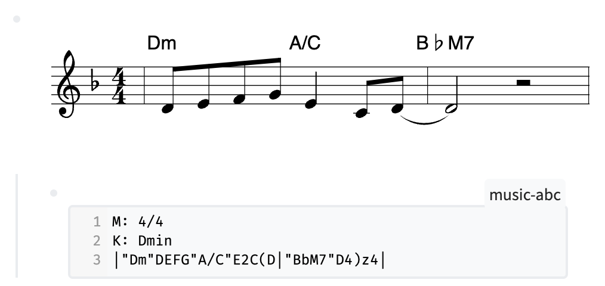

## Music Notation

Renders Music in Logseq using ABC Notation

### Demo



To insert music notation, type `/` and choose `ABC Music Notation`. It will insert a renderer block, and a notation block below it. Simply type ABC Notation into the notation block (between the ```'s), and the notation will render above.

For more information on ABC Notation and how to use it, check out [their website](https://abcnotation.com/learn) or [this tutorial](https://youtu.be/H8hWKP5cEXE?t=310).

Note: there are two edit modes for code blocks, and one behaves better than the other. Editing the music markup when it's rendered, as pictured below, will not update the notation as you type.


Editing the music markup in the **normal** block editing mode, as pictured below, **will** update as you type, so you should prefer using this one. To get into this mode, you can enter the block from below with the arrow key, or you can click slightly above the code box.


##### Logseq.App

- `registerSlashCommand: (tag: string, action: BlockCommandCallback | Array<SlashCommandAction>) => boolean`
- `onMacroRendererSlotted: IUserSlotHook<{ payload: { arguments: Array<string>, uuid: string, [key: string]: any } }>`

### Running the Sample

> 🏷 Minimal version of App [0.4.6](https://github.com/logseq/logseq/releases/tag/0.4.6) !

- `yarn && yarn build` in terminal to install dependencies.
- `Load unpacked plugin` in Logseq Desktop client.

### License

MIT
